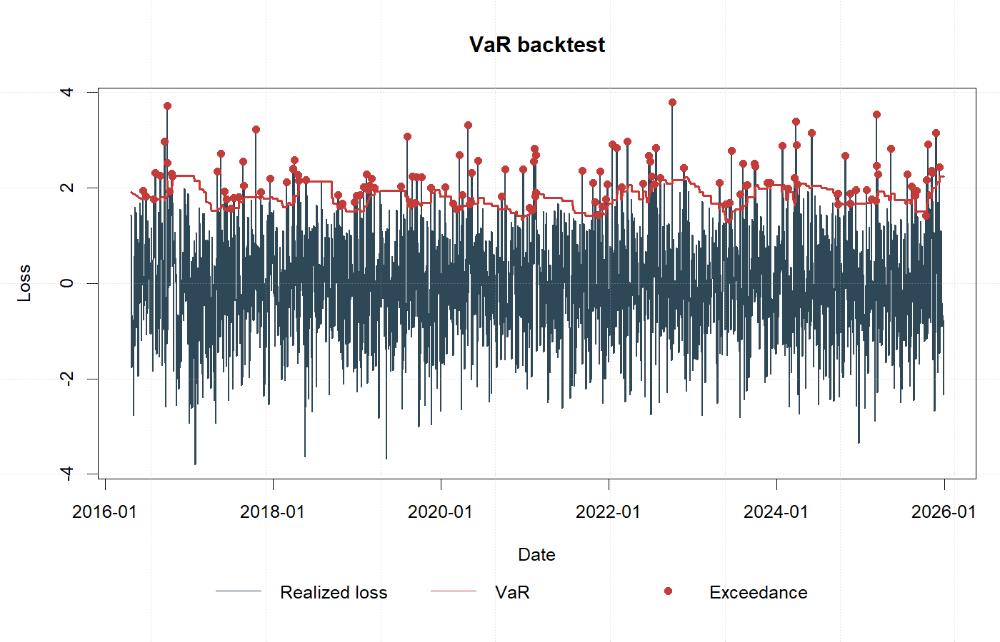

# iqtn

`iqtn` is an R package scaffold for carbon allowance tail-risk forecasting with
interpretable quantile temporal networks.



The current package skeleton focuses on the reusable parts of the workflow:

- CEA market feature construction from daily OHLCV records
- quantile forecast evaluation with pinball loss
- VaR exceedance-rate calculation
- CVaR approximation from predicted upper-tail quantiles
- early-warning level construction from training-period risk-score thresholds

## Installation

```r
# install.packages("remotes")
remotes::install_github("HTL1230/iqtn")
```

## Example

```r
library(iqtn)

data(demo_carbon_market)

features <- carbon_features(demo_carbon_market)
features <- add_future_loss(features, horizons = c(1, 5, 10))

features$var95 <- historical_var(features$loss_h1, alpha = 0.95, window = 120)
features$cvar95 <- historical_cvar(features$loss_h1, alpha = 0.95, window = 120)

pinball_loss(y = c(1, 2, 3), q = c(1.2, 1.8, 2.5), alpha = 0.95)

plot_price_series(demo_carbon_market)
plot_var_backtest(features, loss_col = "loss_h1", var_col = "var95")
```

## Visualization

The package includes lightweight base R plotting helpers for applied risk
monitoring:

- `plot_price_series()`
- `plot_loss_distribution()`
- `plot_var_backtest()`
- `plot_warning_timeline()`
- `plot_risk_score()`
